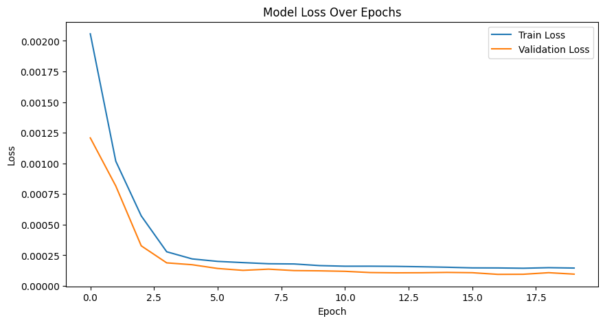
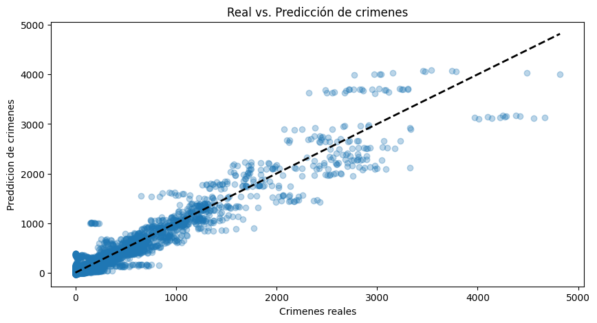
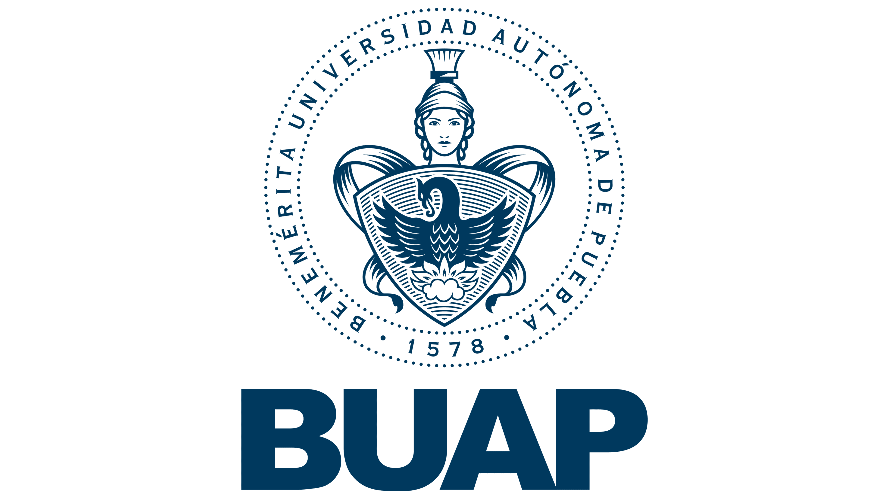
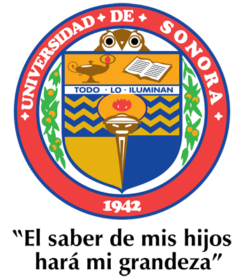

# Predicción del Índice de Violencia en Municipios de México 🇲🇽

Este proyecto tiene como objetivo predecir el índice de violencia en los municipios de México usando redes neuronales y visualizar los resultados en una plataforma web interactiva.

- [Página web estática del proyecto](https://victorhrrios.github.io/idm-delfin-2025)
- [Libreta del proyecto](https://colab.research.google.com/drive/1vMK0E2sDhZ8O-Ryek8GzeW5OwmbKuukB)

## Descripción del Proyecto

Desarrollado durante una estancia de investigación del **Programa Delfín** en la **Benemérita Universidad Autónoma de Puebla (BUAP)**, este proyecto combina ciencia de datos, inteligencia artificial y desarrollo web para analizar y visualizar patrones de violencia a nivel municipal en México.

Se utilizó un conjunto de datos del **INEGI** que abarca desde 2015 hasta 2025 para entrenar y evaluar modelos predictivos. Los resultados se presentan a través de una interfaz web moderna que permite explorar predicciones mensuales mediante un mapa interactivo.

## Tecnologías Utilizadas

- **Python** – para procesamiento de datos y entrenamiento del modelo (con bibliotecas como Pandas, Scikit-learn, etc.).
- **Redes Neuronales TensorFlow** – para predicción del índice de violencia.
- **Leaflet.js** – para visualización de datos geoespaciales en el mapa.

## Flujo de Trabajo

1. **Exploración y análisis de datos**  
   - Gráficas exploratorias
   - Limpieza y preprocesamiento de datos

2. **Preparación del dataset**  
   - Generación de características
   - División del dataset en entrenamiento y validación

3. **Entrenamiento del modelo**  
   - Búsqueda de hiperparámetros
   - Evaluación de resultados

4. **Visualización Web**  
   - Desarrollo de mapa interactivo con selección de año y mes
   - Visualización de predicciones por municipio
   - Gráficas comparativas (`loss.png`, `realvspred.png`)

## Capturas

| Gráfica de pérdida | Real vs Predicción |
|--------------------|--------------------|
|  |  |

## Créditos

Este proyecto fue realizado por **Víctor Hugo Ramírez Ríos**, estudiante de la **Universidad de Sonora**, con la **Dra. Gabriela Yáñez** como supervisora durante la estancia en la **BUAP**.

Agradecimientos especiales al:

- **Programa Delfín**  
- **Universidad de Sonora (UNISON)**  
- **Benemérita Universidad Autónoma de Puebla (BUAP)**  
- **Dra. Gabriela Yáñez**, por su guía y apoyo académico.

  
  
  

